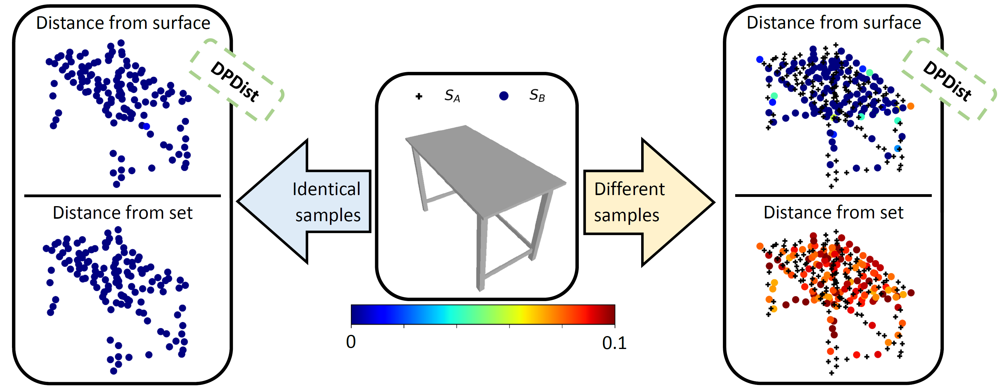

# ***DPDist***: Comparing Point Clouds Using Deep Point Cloud Distance (ECCV 2020)
Created by [Dahlia Urbach](https://www.linkedin.com/in/dahlia-urbach-97a816123/), [Yizhak Ben-Shabat (Itzik)](http://www.itzikbs.com), and [Michael Lindenbaum](http://www.cs.technion.ac.il/people/mic/index.html) from Technion.

### Introduction

We introduce a new deep learning method for point cloud comparison.  Our approach, named Deep Point Cloud Distance (DPDist),   measures the distance between the points in one cloud and the estimated surface from which the other point cloud is sampled. 
The surface is estimated locally using the 3D modified Fisher vector representation. The local representation reduces the complexity of the surface, enabling effective learning, which generalizes well between object categories. 
We test the proposed distance in challenging tasks, such as similar object comparison and registration, and show that it provides significant improvements over commonly used distances such as Chamfer distance,  Earth mover's distance, and others. 

#### Videos
- Our one minute talk: [Video](https://www.youtube.com/watch?v=uiLmk19HFx0) 
- Longer explanation video (presented in [iGDL](https://gdl-israel.github.io/)): [Video](https://youtu.be/c8_32IVn-sg?t=4494)

### Citation

Full paper: https://link.springer.com/chapter/10.1007%2F978-3-030-58621-8_32
arXiv version: https://arxiv.org/abs/2004.11784v2

If you find our work useful in your research, please cite our work:

Preprint: 

    @article{urbach2020dpdist,
      title={DPDist: Comparing Point Clouds Using Deep Point Cloud Distance},
      author={Urbach, Dahlia and Ben-Shabat, Yizhak and Lindenbaum, Michael},
      journal={arXiv preprint arXiv:2004.11784},
      year={2020}
    }

### Instruction
1. **Requirements**
    
    Tensorflow>=1.14
2. **Data**
    
    We used [PointNet++ repo](https://github.com/charlesq34/pointnet2) dense resampling of 10k points from each CAD model of ModelNet40 to:
(a) Get a normalized size point cloud, (b) generate 10k points which are close to the surface and their ground truth distance, and (c) generate 10k points which are somewhere in the unit cube and their GT distance.
    
    - Generate data:
After downloading the re-sampled data from PointNet++ repo into the following folder: `data/modelnet40_normal_resampled`, 
then use `dataset_sample_with_gt.py` to generate the off surface points and their GT distance.
    
    - Download generated data:
    
        `python3 dataset_sample_with_gt.py --download 1`

3. **Train DPDist**
    
    Run: `python3 train_multi_gpu_pc_compare_dist.py` (please see default parameters)

4. **DPDist as a loss function**
    - We use DPDist as loss function to train a registration network named PCRNet (**[[PCRNet Paper]](https://arxiv.org/abs/1908.07906)**).
    PCRNet code and requiements can be found here: https://github.com/vinits5/pcrnet 
    - Dataset:
    
        First, 
        
        `cd pcrnet-registration\utils`
        
        After generating/downloading the dataset for DPDist training, 
        for each category run the following:
        
        `python3 data_txt_to_hdf5.py --cat chair`
    - Train and eval PCRNet:
    
        `./run_train_and_eval_PCRNet.bash`
        
The data and pre-trained models will be available soon.

### Updates
For updates please follow this repository or my [twitter](https://twitter.com/DahliaUrb) page.

### License
Our code is released under MIT License (see LICENSE file for details).
